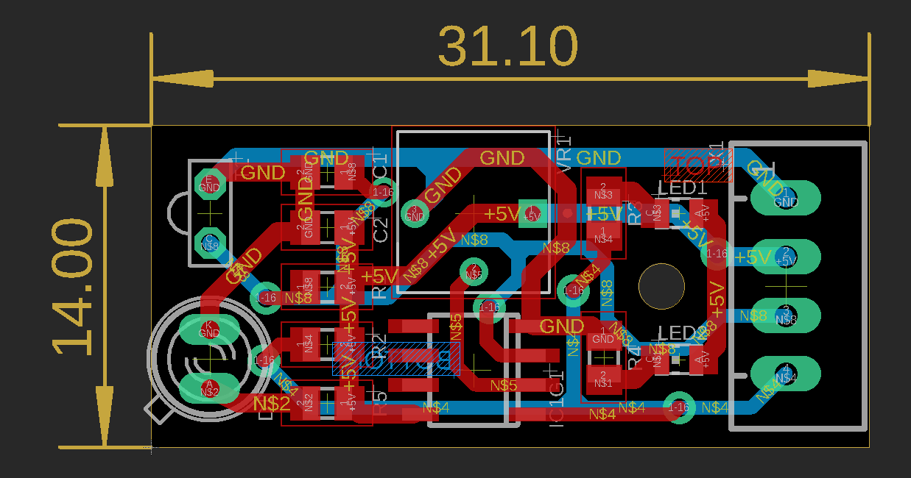
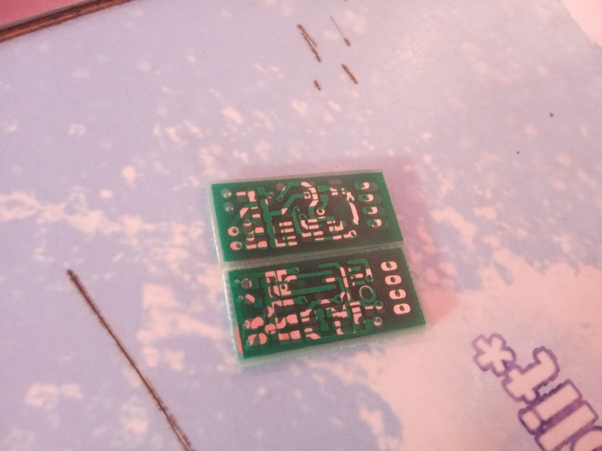
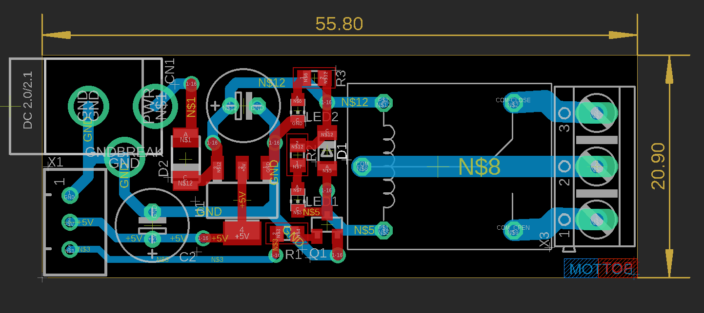
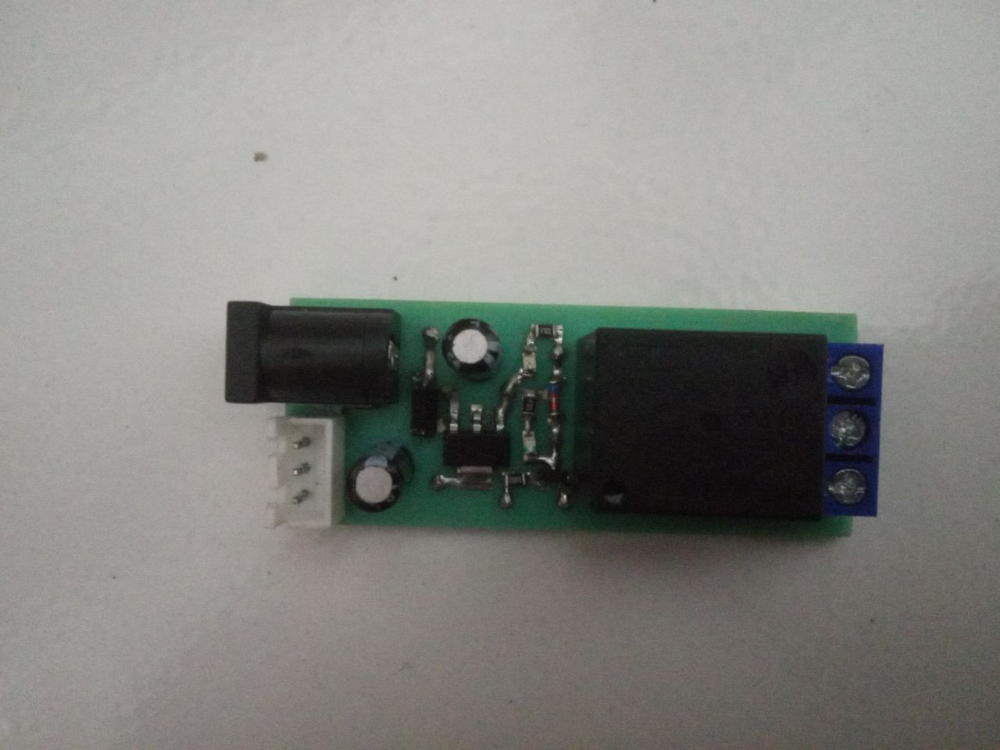
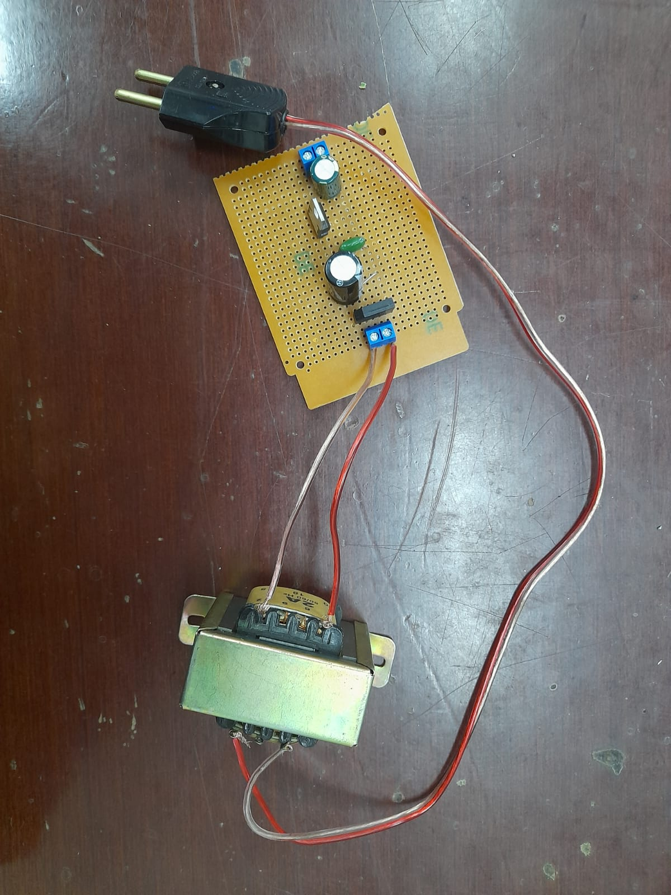

# embedded-portfolio
This repo contains something I am currently learning in computer engineering.

## Hardware Programming
I have never done a real project with microcontroller. Just learning each peripheral function of microcontroller such as GPIO, UART, I2C, ADC, etc. to interfacing some devices. I start learn the concept of hardware programming using avr 8-bit microcontroller (ATmega16A) using avr-libc. Learn how to read datasheet and trying to write a simple hardware abstraction layer to achieve the functionality of each peripherals and write a simple libraries to interfacing some devices such as LCD and sensors. Then moving to arm cortex 32-bit microcontroller using stm32f401 (Blackpill board). Firstly, I tried to do the same thing like in avr, direct accessing register of each peripheral, configuring it, etc. But, stm32 has much more features and complex configuration compared to avr 8-bit and it takes a lot of time in development. Also, the free resources to learn "baremetal stm32" is very limited. Honestly, I got stuck when trying configure the system clock, Lol. So, I decided to use STM32CubeMX, a software by ST that can makes your life easier. With that you can generate a HAL or LL API for initializing each peripherals we wanna use using GUI. I use LL here.
These are my development tools
- AVR:
  - avr-libc, avr-binutils
  - avr-gcc
  - avrdude
  - make
  - vscode
  - usbasp
- STM32:
  - arm-gnu-toolchain
  - openocd
  - stm32cubemx
  - make
  - vscode
  - st-link v2

## PCB Design
Team project for a college project assignment. The project is about reverse engineering some common module and modifying it. The module is IR Sensor and Relay driver. My role in my team is designing the board. I also did troubleshooting to make sure our module works properly. There are some requirement must be followed in this project in designing the board.  To be honest, I am not satisfied with my design in IR Sensor module. the requirement is we must have the same size with module we have reverse engineered while adding more traces for analog output. Most of the place for printing the PCB here is also cannot make a small hole for via and not able to make plated through hole board because everything is done manually by hand. And the worst thing is we got a pretty bad place which some of holes are not drilled properly and the masking is wrong.  As you can see, those are my team's board and other team's board which the masking is switched, Lol. We did a lot of troubleshooting in this board since it didn't work as expected. The Relay Driver module project was designed based on what we've learnt from the result of the first board. This one just works perfectly.  

## Electronics
The first team project in my first semester of computer engineering. Making a simple linear power supply

## Software
- Team's project for college assignment on web development database management. [link](github.com/iorvrse/penjadwalan)
- Team's project for c++ desktop gui.
